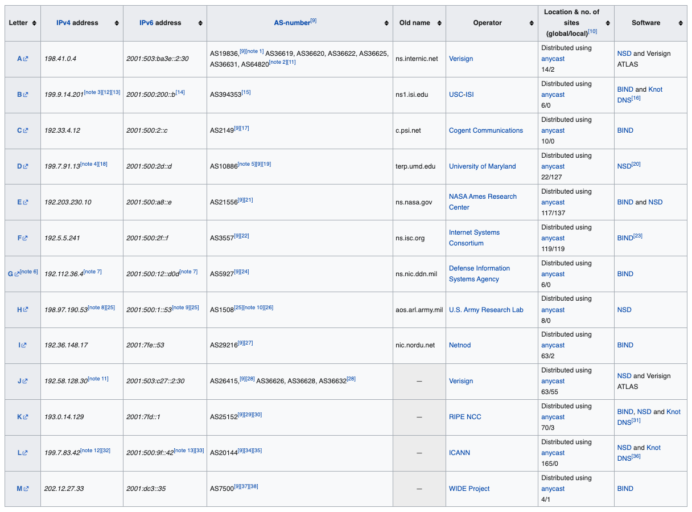

## DNS(Domain Name System)란 무엇인가?

DNS(Domain Name System)란 도메인 주소를 IP주소로 변환하는 시스템이다. 즉, `www.example.com`과 같은 컴퓨터의 도메인 이름을 `192.168.1.0`과 같은 IP 주소로 변환해주는 시스템이다.

## DNS를 왜 사용하는가?

인터넷은 TCP/IP 기초하여 만들어졌다. TCP/IP 기반의 네트워크는 IP주소로 서로 통신하게 된다. 즉, IP 주소를 모르면 통신이 불가능하다. 그렇다면 통신을 할 때 URL에 IP주소를 사용하면 좋을 것이라고 생각할 수 있다. 실제 IP주소를 사용해도 올바르게 작동한다.

하지만, 전화번호를 기억하기가 어려운 것과 마찬가지로 숫자를 나열한 IP주소는 기억하기 어렵다. 그렇기 때문에 IP주소가 아닌 기억하기 쉬운 도메인명을 사용하는 것이 좋기 때문에 DNS를 사용한다.

## DNS는 어떻게 작동하는가?

### DNS의 기본적인 작동원리

DNS 작동원리를 간단히 설명하면 클라이언트(PC)에서 조회 메시지(이름, 클래스, 타입)를 DNS 서버에 요청하고, DNS 서버는 클라이언트에서 전송한 조회메시지를 확인 후 그에 대응하는 IP주소를 응답하는 방식이다.

1. 자신의 PC에 IP 주소뿐만이 아닌 도메인명으로도 접속할 수 있게 하기 위해 DNS 서버에게 자신의 IP주소(`93.184.216.34`)와 도메인명(`example.com`)으로 등록을 요청한다.
2. DNS 서버는 1번의 요청을 받고 해당 도메인명과 IP주소를 매핑하여 서버에 기록한다.
3. `example.com`이라는 도메인명을 가진 서버에 접속하고 싶은 클라이언트에서 DNS서버에게 `example.com`도메인명과 함께 IP주소를 응답을 요청한다.
4. DNS서버는 기록되어있는 도메인명과 맵핑된 IP주소를 응답한다.
5. IP주소를 응답받은 클라이언트는 해당 IP주소로 서버에 접속한다.

지금까지 기본적인 DNS 작동원리를 살펴보았다. 하지만 DNS의 작동원리는 위처럼 간단하지 않다. 좀 더 상세하게 DNS 작동원리에 대해 알아보자.

### 도메인 계층 구조

우선 도메인 계층 구조를 알아보자. 도메인명은 계층 구조로 되어있으면 맨 오른쪽 생략된 Root(`.`)를 시작으로 뒤에서 앞으로 해석되며 `.` 으로 각 계층의 경계를 표시한다.

위의 그림에서 보이듯이 맨 오른쪽 ‘.’은 Root 도메인이라고 하고, ‘com’은 Top-level 도메인 example 은 Second-level 도메인, blog는 sub 도메인으로 구분 된다.

### DNS 서버 계층 구조

DNS 서버는 도메인 계층과 비슷하게 계층적으로 구성된다. 각 DNS 서버는 자신이 담당하는 영역에 대한 도메인을 관리한다.

위 예시와 같이 루트 DNS 서버 부터 하위로 com, org 등과 같은 최상위 도메인을 관리하는 DNS 서버가 있으며 그 하위로 yahoo, amazon 등과 같은 2차 도메인을 관리하는 DNS서버 그리고 또 그 하위 도메인을 관리하는 DNS서버가 있다.

이렇게 계층적으로 전세계에 수천 수만대의 DNS서버가 협력하여 시스템을 이루고 있다.

<aside>
💡 루트 DNS 서버는 총 13개이며 최상위 도메인, 2차 도메인 등을 관리하는 DNS 서버는 많은 수의 서버가 존재하고 있다.

</aside>

#### 루트 DNS 서버

루트 DNS 서버는 ICANN 이라는 비영리 단체에서 관리하는 DNS 서버이며, 전 세계에 13대의 루트 DNS 서버가 존재한다.  ~~즉 13대의 루트 DNS 서버를 찾아내어 파괴하면 인터넷을 마비 시킬수 있다~~

#### DNS 서버 탐색 과정

DNS 서버는 각자 담당하는 도메인을 관리하게 되며 상위 DNS 서버는 하위 DNS 서버에 대한 정보를 알고있다. 즉 상위 DNS 서버에 도메인을 요청하면 자신이 알고있는 하위 DNS 서버의 IP주소 목록을 반환하고 해당 IP주소를 통해 다시 하위 DNS를 탐색을 하는 과정을 반복하여 최종적으로 목적지 주소를 알고 있는 DNS로 도달하게 된다.

클라이언트에서 [example.com](http://example.com) 을 접속한다고 가정해보자.
~~(그림 실력이 엉망이라 죄송합니다ㅠ)~~

> 모든 DNS 서버는 루트 DNS 서버의 주소를 알고 있다.
1. 클라이언트 PC 브라우저에서 [example.com](http://example.com) 을 입력하면 운영체제에 설정된 DNS 서버에 요청한다.
2. DNS 서버에 캐시된 example.com의 IP 주소가 존재하면 해당 IP 주소를 반환하고 캐시된 정보가 없으면 ROOT DNS 서버에 요청한다.
3. ROOT DNS 서버는 example.com의 IP주소를 알지 못함으로 최상위 도메인(com)에 대해 알고 있는 최상위 도메인을 관리하는 DNS 서버의 IP 주소를 응답한다.
4. DNS 서버는 루트 DNS 서버가 응답한 최상위 DNS 서버의 IP 주소 목록을 확인하여 다시 최상위 DNS 서버에게 요청한다.
5. 최상위 DNS 서버는 2차 도메인(example)을 알지 못함으로 2차 도메인을 알고 있는 DNS 서버의 IP 주소를 응답한다.
6. DNS 서버는 최상위 DNS 서버가 응답한 2차 DNS 서버의 IP 주소 목록을 확인하고 2차 DNS 서버에게 요청한다.
7. 2차 DNS 서버는 example.com에 대한 IP 주소를 알고 있기 때문에 해당 하는 IP 주소를 반환한다.
8. DNS 서버는 최종목적지의 IP주소를 응답받아 해당 IP를 캐시한 후 클라이언트에게 IP 주소를 응답한다.
9. 클라이언트 PC는 응답받은 IP주소로 서버에 접속한다.

## 마무리

오늘 글에서는 DNS란 무엇인지, 왜 사용하는지, 어떻게 작동하는지에 대해 알아보았습니다. DNS는 인터넷 세상에서 매우 중요한 역할을 하는 시스템이라고 생각합니다. 오늘 글을 통해서 DNS 시스템에 대해 알고싶은 누군가에게 조금이나마 도움이되었으면 합니다 :)

## 참고

- [WEB2-Domain Name System](https://youtube.com/playlist?list=PLuHgQVnccGMCI75J-rC8yZSVGZq3gYsFp)
- [성공과 실패를 결정하는 1%의 네트워크 원리](http://www.yes24.com/Product/Goods/90640081)
- [TCP/IP 쉽게, 더 쉽게](http://www.yes24.com/Product/Goods/32203210)
- [Dns-server-hierarchy](https://commons.wikimedia.org/wiki/File:Dns-server-hierarchy.gif)
- [How a DNS Server (Domain Name System) works.](https://www.youtube.com/watch?v=mpQZVYPuDGU&t=188s)